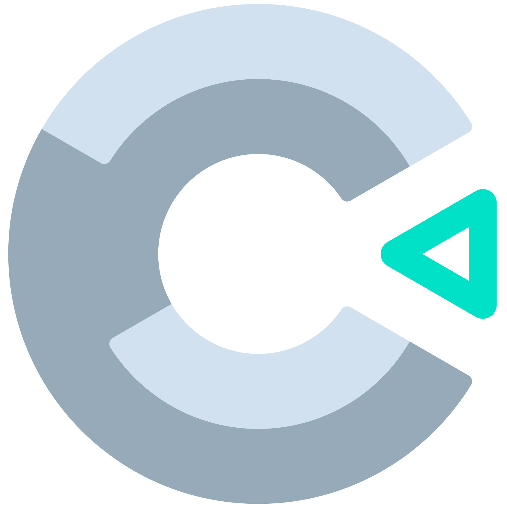

<br>
# measure_text <br>
Measures the text <br>
<br>
Author: skymen <br>
<sub>Made using [c3ide2-framework](https://github.com/ConstructFund/c3ide2-framework) </sub><br>

## Table of Contents
- [Usage](#usage)
- [Examples Files](#examples-files)
- [Properties](#properties)
- [Actions](#actions)
- [Conditions](#conditions)
- [Expressions](#expressions)
---
## Usage
To build the addon, run the following commands:

```
npm i
node ./build.js
```

To run the dev server, run

```
npm i
node ./dev.js
```

The build uses the pluginConfig file to generate everything else.
The main files you may want to look at would be instance.js and scriptInterface.js

## Examples Files

---
## Properties
| Property Name | Description | Type |
| --- | --- | --- |


---
## Actions
| Action | Description | Params
| --- | --- | --- |


---
## Conditions
| Condition | Description | Params
| --- | --- | --- |


---
## Expressions
| Expression | Description | Return Type | Params
| --- | --- | --- | --- |
| MeasureWidth | Measures the width of the given text. | number | Text *(string)* <br> | 
| MeasureHeight | Measures the height of the given text. | number | Text *(string)* <br> | 
| FullWidth | Measures the width of the object's text. | number |  | 
| FullHeight | Measures the height of the object's text. | number |  | 
